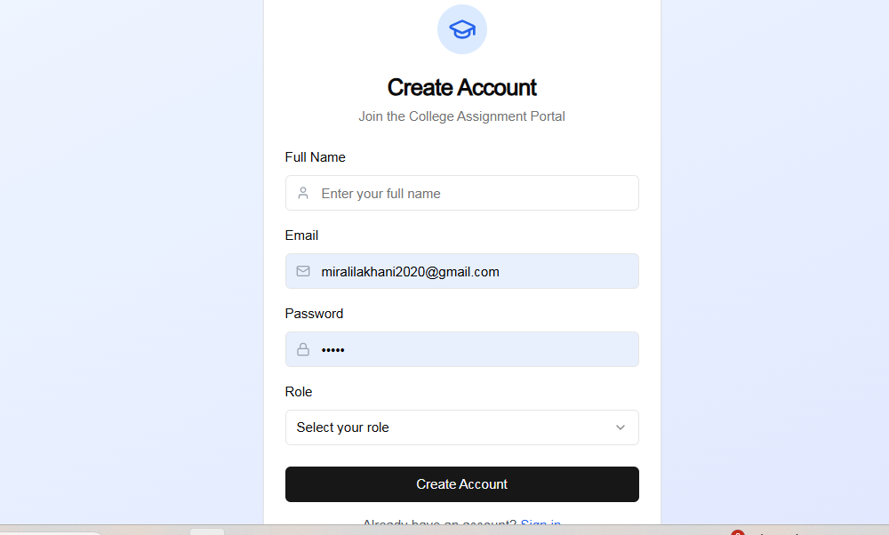
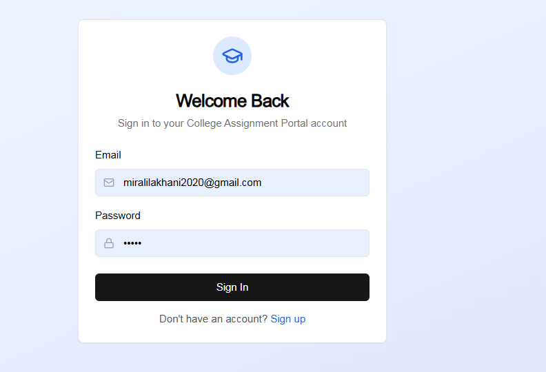
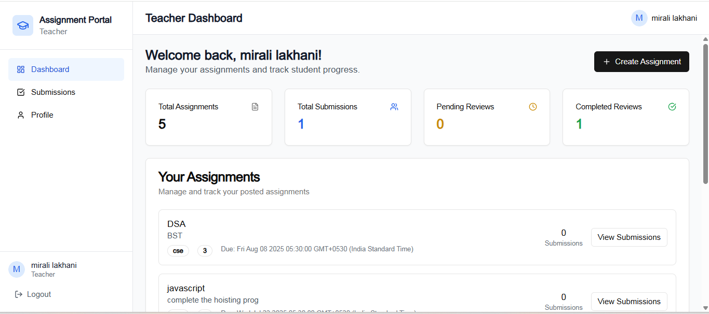
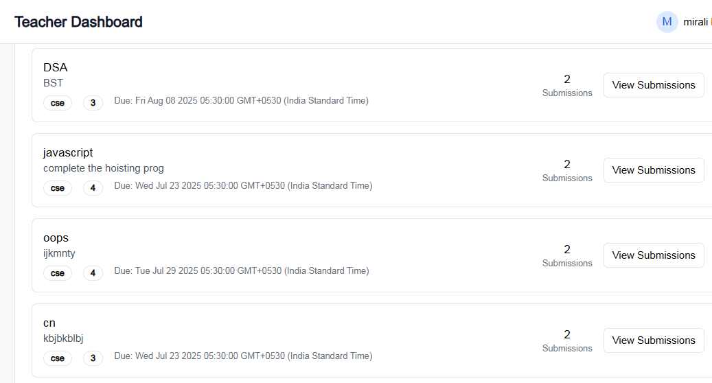
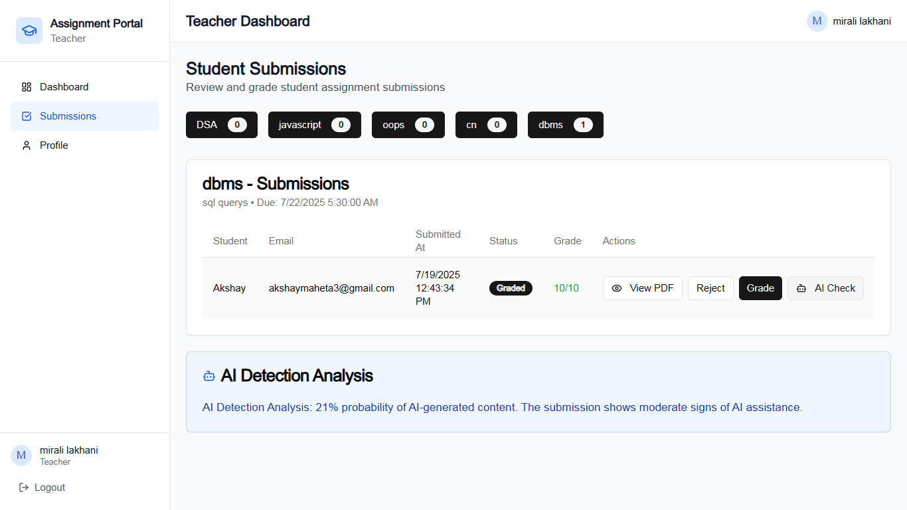
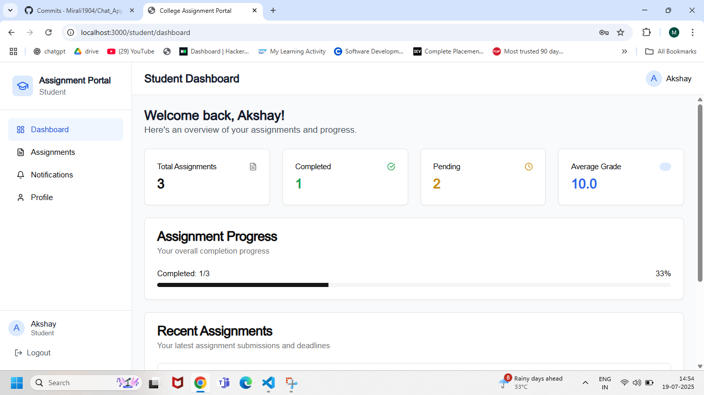
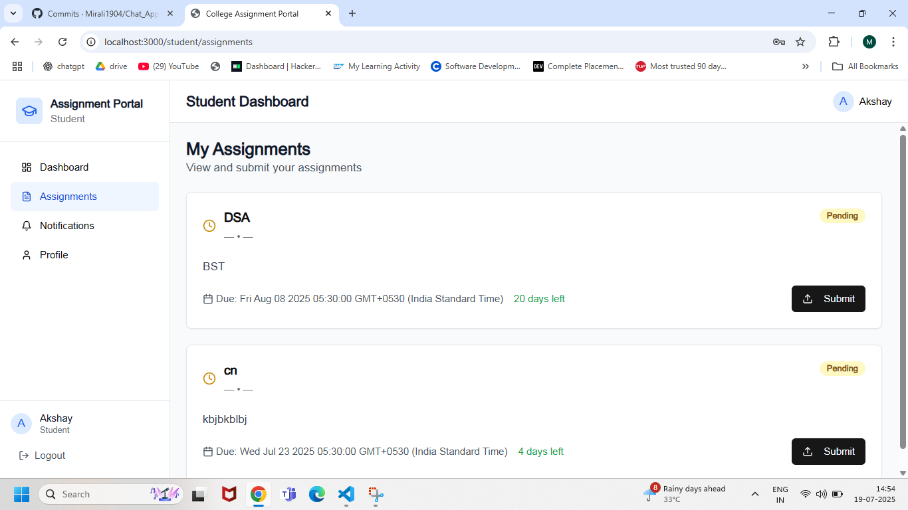
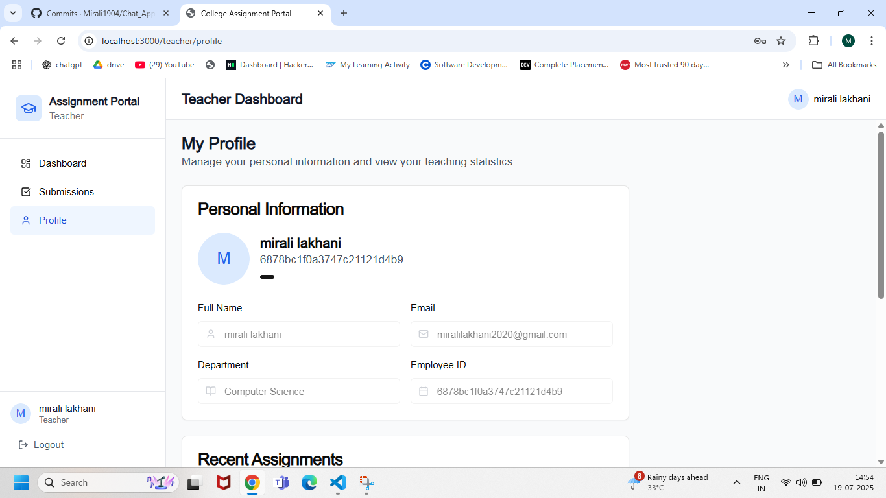

# 🎓 Assignment Portal

A full-stack web application for managing college assignments. This portal allows teachers to upload assignments and grade them, while students can view, submit, and track their assignment progress.

## 🚀 Features

### 👨‍🏫 Teacher Features
- Create and publish assignments
- View student submissions
- Grade and give feedback

### 👩‍🎓 Student Features
- View assigned tasks
- Upload assignment submissions
- Track submission status and grades

## 🛠️ Tech Stack

- **Frontend**: Next.js, Tailwind CSS, React
- **Backend**: Node.js, Express.js, MongoDB
- **File Upload**: Multer + Cloudinary

## 📸 Screenshots














## ⚙️ How to Run Locally

```bash
# Clone the repo
git clone https://github.com/your-username/assignment-portal.git

# Go into the project
cd assignment-portal

# Install dependencies
npm install

# Start the backend server
cd backend
npm start

# Start the frontend
cd ../frontend
npm run dev
